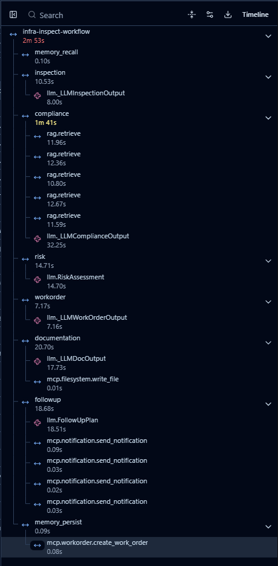
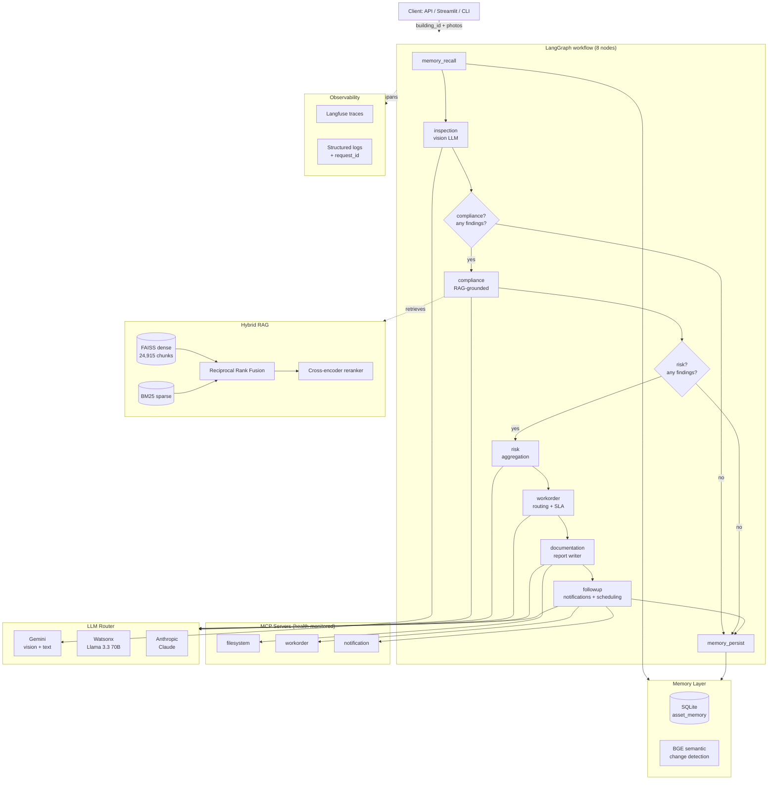

# infra-inspect-ai

**End-to-end AI inspection: photo to work order with traces and memory.**

[](https://www.python.org/downloads/)
[](https://opensource.org/licenses/MIT)
[](#tests)
[](https://langfuse.com)

A production-grade multi-agent system that turns building inspection photos into grounded compliance findings, prioritized work orders, audit-ready reports, and follow-up notifications — with full observability, request-level correlation, and a persistent memory layer.


*One full inspection run, captured in Langfuse. Eight nested spans across six agents, with retrieval and tool-call children. Every span is correlated to the originating HTTP request via X-Request-ID.*

---

## Table of Contents

- [What it does](#what-it-does)
- [Architecture](#architecture)
- [Highlights](#highlights)
- [How it works](#how-it-works)
- [Engineering decisions](#engineering-decisions)
- [What I tried and reverted](#what-i-tried-and-reverted)
- [Evaluation](#evaluation)
- [Quickstart](#quickstart)
- [Configuration](#configuration)
- [API reference](#api-reference)
- [Observability](#observability)
- [Tests](#tests)
- [What's not in scope](#whats-not-in-scope)
- [Tech stack](#tech-stack)
- [Project structure](#project-structure)
- [License and contact](#license-and-contact)

---

## What it does

You give the system a building ID, one or more inspection photos, and free-text inspector notes. It returns:

1. **Findings** extracted from the photos by a vision model (what's wrong, where, how severe)
2. **Compliance violations** grounded in actual building-code passages, retrieved from a 24,915-chunk RAG index over BIS and NFPA standards, with citation source and page
3. **Risk register** with prioritized issues (P1–P4) and explicit impact/probability scoring
4. **Work orders** routed to the right team (electrical, fire, structural, etc.) with cost and SLA
5. **A polished audit report** (Markdown) written to disk via an MCP filesystem server
6. **Notifications** dispatched via an MCP notification server (Slack/email/in-app, urgency-routed)
7. **Memory persistence** — every run is recorded; the next run sees prior findings and classifies new findings as new, persisting, worsening, or improving
8. **A request-scoped audit trail** correlating every log line, Langfuse span, and DB row to the originating HTTP request

The system runs as a FastAPI service, a Streamlit UI, or a Python CLI script. Same workflow, three entry points.

---

## Architecture



---

## Highlights

- **6 agents, 8 nodes, deterministic routing.** Built on LangGraph. Compliance and risk nodes are conditionally skipped when there are no findings — no wasted LLM calls.
- **Hybrid RAG (FAISS dense + BM25 sparse + RRF fusion + cross-encoder reranker)** over 24,915 chunks of building codes (BIS-1893, NFPA-70, NFPA-101). Empirically tuned retrieval threshold via labeled eval set.
- **Multi-provider LLM routing.** Gemini (default), Watsonx (Llama 3.3 70B), Anthropic — single `.env` switch between configurations. Vision tasks self-route to a vision-capable provider.
- **Three MCP servers** for filesystem, work orders, and notifications. Sandboxed subprocesses with background health monitoring and `/health` endpoint aggregation.
- **End-to-end correlation IDs.** `X-Request-ID` is set by middleware, propagated through ContextVars, captured into a background thread, threaded into the workflow state, attached as a Langfuse session ID, and persisted on the inspection-run DB row. One header lets you trace any request across logs, traces, and the database.
- **BGE semantic change detection.** Findings from a new run are classified against historical findings using cosine similarity over BGE embeddings, with a hard category gate and a word-overlap fallback. Catches `"rust on terminals"` ≈ `"corrosion on fuse holders"`.
- **27 unit tests** covering schemas, change detection, risk aggregation, and workflow routing. Mocked embeddings keep the suite under 5 seconds on warm cache.
- **Production observability.** Full Langfuse trace tree per request, structured logs with auto-injected request_id, per-MCP health monitor, `/health` aggregation for orchestrator probes.

---

## How it works

The workflow is a LangGraph state machine. Each node reads and mutates a shared `AgentState`. Conditional edges skip downstream work when prerequisites are missing.

| Node | Role | Inputs | Outputs |
|------|------|--------|---------|
| `memory_recall` | Load prior history for this building | `building_id` | `asset_memory` (summary, recent findings, open work orders) |
| `inspection` | Vision model extracts findings per photo | `photo_paths`, `history` | `inspection_reports` (one per photo) |
| `compliance` | Retrieve building-code chunks, ground each finding | findings | `compliance_violations` with citation source + page |
| `risk` | Deduplicate, score, prioritize | findings + violations | `risk_assessment` with `highest_risk_category` (computed server-side) |
| `workorder` | Generate WOs with SLA, cost, team routing | risk issues | `work_orders` (one per issue) |
| `documentation` | Compose Markdown audit report, write via MCP | full state | `report_path` |
| `followup` | Dispatch notifications, schedule re-inspections | work orders | `notifications`, `scheduled_tasks` |
| `memory_persist` | Record everything (findings, work orders, request_id) | full state | `memory_run_id` |

The conditional edges (`should_run_compliance`, `should_run_risk`) are pure functions over state — covered by unit tests in `tests/test_workflow_helpers.py`.

---

## Engineering decisions

The non-obvious decisions, with the reasoning.

### 1. Multi-provider LLM routing, with task-aware overrides

Different agents use different providers via `.env`:
```
DEFAULT_LLM_PROVIDER=gemini       # text agents
VISION_LLM_PROVIDER=gemini        # vision agent (can differ)
```
Why two settings: vision-capable models have stricter pricing and lower rate limits. Letting the vision agent self-route lets you, for example, run text on free-tier Watsonx Llama and vision on Gemini, doubling effective quota. The router is `src/llm/router.py`. Adding a provider is one branch in `get_llm()`.

Watsonx clients are cached per `(model_id, temperature)` via `@lru_cache(maxsize=8)`. Each instantiation does three HTTPS round trips (IAM token, project verify, model list). Caching saves ~24s per workflow with 5 text agents.

### 2. Hybrid retrieval, not just dense

FAISS dense embeddings handle semantic similarity. BM25 handles exact phrase and acronym matches (`"NFPA-70"`, `"section 4.3.1"`). Reciprocal Rank Fusion combines them with `k=60`. A cross-encoder reranker (BGE-reranker-base) re-scores the top 20 fused hits and keeps top 5.

Why all four stages: dense alone misses code numbers. Sparse alone misses paraphrases. RRF combines without needing to learn weights. Reranking sharpens the final selection because lexical/semantic overlap doesn't always mean relevance.

### 3. Empirically tuned retrieval threshold

The default retriever threshold (0.30) discarded 60% of legitimate hits. I built a labeled eval set (`data/eval/retrieval_eval_set.json`), ran a threshold sweep, picked the empirical optimum:

| Threshold | Precision | Recall | F1 | Zero-chunk failures |
|-----------|-----------|--------|----|--------------------:|
| 0.05      | 0.20      | **0.583** | **0.298** | **0** |
| 0.10      | 0.20      | 0.417  | 0.270 | 1 |
| 0.15      | 0.00      | 0.250  | 0.000 | 3 |
| 0.20      | 0.00      | 0.250  | 0.000 | 3 |
| 0.30 (default) | 0.00 | 0.183 | 0.000 | 3 |


The F1 is modest in absolute terms. What matters: zero-chunk failures drop from 3/10 to 0/10 at `MIN_RETRIEVAL_SCORE=0.05`. Without this, 30% of findings would silently get no compliance grounding. The story is **data-driven configuration**, not magic numbers.

### 4. Server-side aggregation beats LLM aggregation

The Risk Agent's `highest_risk_category` was originally set by the LLM. It was often `None` because the LLM didn't reliably populate it. Fix: compute it deterministically from the `issues` list in `_compute_highest_risk_category()`. Tie-breaks by issue count.

This is a general principle: anything that's a simple aggregation (sum, max, count, group-by) belongs in code, not in the LLM. Every aggregation handed to the LLM is a hallucination opportunity.

### 5. BGE semantic change detection (with lexical fallback)

When a new inspection finds `"Corrosion on fuse holders and terminals"` and the prior run said `"Rusted electrical fuse housings"`, word overlap fails. BGE-small-en cosine similarity catches it (~0.72-0.85 on real paraphrases).

The matching is gated by category — an `electrical` finding never matches a `plumbing` history, regardless of text similarity. Lexical word-overlap remains as a fallback when embeddings fail to load. Sample scores from a real run: `frayed wiring: 0.92`, `overcrowded wiring: 0.98`, `corroded terminals: 0.97`, `dust accumulation: 0.94`, `unidentified wiring: 1.00`.

### 6. End-to-end correlation IDs

A `X-Request-ID` middleware (or generates one as `req_<hex>`) sets a `ContextVar`. A structlog processor injects it into every log line automatically. FastAPI's BackgroundTasks runs in a thread (ContextVars don't auto-propagate across threads), so the request_id is explicitly captured and re-set inside `_run_workflow_job`. The workflow propagates it through `AgentState.request_id` and writes it to the `inspection_runs` table. The Langfuse trace is tagged with `session_id=<request_id>` so all spans for a request are filterable in the UI.

Result: one header lets you trace any failed inspection across logs, distributed traces, and the database — without correlation by timestamp.

---

## What I tried and reverted

### Parallel RAG retrievals via ThreadPoolExecutor

The compliance agent's 5 sequential retrievals took ~60s, dominated by cross-encoder reranking. The naive optimization was `ThreadPoolExecutor(max_workers=5)`.

**Result:** total time dropped from 60s to 48s. **But:** per-batch latency grew from 5-10s to 47-60s.

**Why:** PyTorch CPU inference doesn't release the GIL as cleanly as `numpy` or FAISS. Five concurrent reranker threads contend for the same cores; Python overhead multiplies while actual matmul stays constant. The "speedup" was a 1.2× rounding error that made each individual span much worse to read in Langfuse.

**The right fix:** batch all 5 queries into a single `CrossEncoder.predict()` call, amortizing model invocation overhead. Deferred for a future iteration.

**Lesson:** profile before parallelizing. GIL-free claims for PyTorch operations are environment-dependent. CPU-bound parallelism needs multi-process or GPU, not threads.

The change is reverted; the lesson stays.

---

## Evaluation

### Retrieval evaluation set

`data/eval/retrieval_eval_set.json` contains 10 labeled findings, each annotated with the expected ground-truth chunks from the building-code corpus. The eval framework (`scripts/evaluate_retrieval.py`) computes precision, recall, F1, and zero-chunk-failure count for any retriever configuration.

### Methodology

For each finding in the eval set:
1. Build a query string (`{category} {issue} {visual_evidence[:120]}`)
2. Run the full retriever pipeline (hybrid + rerank) at varying thresholds
3. Compare kept chunks to ground-truth chunks via fuzzy text match (Levenshtein > 0.8)
4. Aggregate precision, recall, F1, zero-chunk rate

### Sweep results

See the [Engineering Decisions](#3-empirically-tuned-retrieval-threshold) section above for the full table and chart. Optimal threshold is 0.05; F1 improves 3.2× over the default 0.30; zero-chunk failures drop to zero.

### Caveats

- 10 findings is a small set. Numbers are directionally meaningful but not statistically robust.
- Ground-truth labels were generated semi-automatically with LLM-as-judge. A larger human-labeled set would shift absolute numbers.
- F1 is held back by precision (the retriever keeps too much). Future work: tune top_k after reranking.

---

## Quickstart

```bash
# 1. Clone
git clone https://github.com/shoubhit-kumar/infra-inspect-ai.git
cd infra-inspect-ai

# 2. Install
python -m venv .venv
source .venv/bin/activate          # Windows: .venv\Scripts\Activate.ps1
pip install -e ".[all]"

# 3. Configure (.env)
cp .env.example .env
# Fill in at least GOOGLE_API_KEY for vision and text.
# LANGFUSE_PUBLIC_KEY/SECRET_KEY are optional but recommended.

# 4. Ingest building codes (one-time, ~5 min)
# Drop BIS-1893.pdf, NFPA-70.pdf, NFPA-101.pdf into data/building_codes/
python -m scripts.ingest_codes
python -m scripts.build_bm25

# 5. Run a CLI workflow
python -m scripts.test_workflow

# 6. Or start the API
uvicorn src.api.app:app --reload

# 7. Or start the Streamlit UI
streamlit run app.py
```

---

## Configuration

Required `.env` keys:

| Variable | Purpose | Required |
|----------|---------|----------|
| `GOOGLE_API_KEY` | Gemini API key | Yes (or alternative provider) |
| `WATSONX_API_KEY`, `WATSONX_URL`, `WATSONX_PROJECT_ID` | IBM Watsonx | If using Watsonx |
| `ANTHROPIC_API_KEY` | Claude API | If using Anthropic |
| `LANGFUSE_PUBLIC_KEY`, `LANGFUSE_SECRET_KEY`, `LANGFUSE_HOST` | Tracing | Optional |
| `HF_TOKEN` | HuggingFace (silences auth warnings) | Optional |
| `DEFAULT_LLM_PROVIDER` | Default for text agents: `gemini` \| `watsonx` \| `anthropic` | Yes |
| `VISION_LLM_PROVIDER` | Override for vision agent | Yes |
| `MIN_RETRIEVAL_SCORE` | Floor for retriever cutoff (default 0.05) | Optional |

See `.env.example` for the full template.

---

## API reference

### `POST /inspections`

Submit an async inspection job. Returns immediately with a job ID.

**Request:**
```bash
curl -X POST http://localhost:8000/inspections \
  -H "Content-Type: application/json" \
  -H "X-Request-ID: my-trace-id-001" \
  -d '{
    "building_id": "BLDG-001",
    "photo_paths": ["data/sample_photos/electrical_panel_unsafe.png"],
    "inspector_notes": "Routine annual safety inspection"
  }'
```

**Response (HTTP 202):**
```json
{
  "job_id": "job_a4f78e3edbbf",
  "request_id": "my-trace-id-001",
  "status": "queued",
  "poll_url": "/jobs/job_a4f78e3edbbf"
}
```

### `GET /jobs/{job_id}`

Poll for status and result. Returns the same `request_id` so you can correlate.

### `GET /health`

Liveness + dependency check. Aggregates per-MCP-server health:

```json
{
  "status": "ok",
  "mcp_servers": [
    {"name": "filesystem", "status": "healthy", "consecutive_failures": 0, "total_pings": 47},
    {"name": "workorder", "status": "healthy", "consecutive_failures": 0, "total_pings": 47},
    {"name": "notification", "status": "healthy", "consecutive_failures": 0, "total_pings": 47}
  ]
}
```

Aggregate `status` rolls up: `ok` if all healthy/unknown, `degraded` if any degraded, `unhealthy` if any unhealthy. Kubernetes readiness probes can route off this directly.

### `GET /memory/{building_id}`

Returns the memory snapshot for a building: prior inspections, open work orders, recent findings.

Full OpenAPI spec available at `http://localhost:8000/docs`.

---

## Observability

Every workflow run produces a Langfuse trace tree like the one at the top of this README. The trace structure mirrors the LangGraph node hierarchy, with retrieval and tool-call spans nested under each agent.

Each trace is tagged with:
- `session_id = X-Request-ID` (filter all spans for a request)
- `metadata.request_id` (redundant for queryability)
- Per-span `level=ERROR` when an exception fires

Structured logs include `request_id` automatically on every line within a request scope. Example log line:
```
INFO  memory.recall  building_id=BLDG-001  open_work_orders=82  request_id=my-trace-id-001
```
The same `request_id` appears in the `inspection_runs` SQLite table, giving you a SQL-queryable audit trail:

```sql
SELECT id, building_id, compliance_status, request_id
FROM inspection_runs
WHERE request_id = 'my-trace-id-001';
```

---

## Tests

```bash
pytest -v                          # all 27 tests, ~5s on warm cache
pytest tests/test_schemas.py       # one file
pytest -k "severity"                # tests matching keyword
```

### What's tested

| Suite | What |
|-------|------|
| `test_schemas.py` | Pydantic validation: field constraints, enum vocabulary, defaults |
| `test_change_detection.py` | Severity ranking, cosine math, lexical + semantic classification, category gate |
| `test_risk_helpers.py` | `_compute_highest_risk_category` aggregation + tie-breaking |
| `test_workflow_helpers.py` | `_derive_status` decision tree, conditional routing edges |

### What's deliberately not tested

| Component | Reason |
|-----------|--------|
| Agent `.run()` methods | Make real LLM calls. Covered by end-to-end `scripts/test_workflow.py` runs. |
| FAISS retrieval | Slow (loads ~500MB index). Covered by `scripts/evaluate_retrieval.py`. |
| MCP servers | Subprocess setup is environment-dependent. Covered by `scripts/test_mcp_*.py`. |
| Streamlit UI | UI testing requires separate infrastructure (Playwright). Out of scope. |
| Watsonx | External service dependency. Covered by `scripts/test_watsonx.py`. |

Test mocking uses a 16-dim hash-based embedder fixture (`tests/conftest.py::fake_embedder`) so semantic-similarity tests don't load the real 130MB BGE model. Test suite stays fast.

---

## What's not in scope

These are deferred. Calling them out explicitly because their absence is a deliberate choice for a portfolio/learning project, not a gap to apologize for.

| Feature | Why deferred | What I'd do |
|---------|--------------|-------------|
| Multi-worker concurrency | Single-process uvicorn handles the demo. `JobRegistry` is thread-safe but in-memory. | Promote to Redis + Postgres if multi-worker. |
| Postgres backend | SQLite handles 100K+ writes/sec on single-writer workloads. We do ~5 writes per inspection. | SQLAlchemy abstracts dialect; swap `make_engine` URL. |
| Managed vector DB | FAISS handles 24K chunks in milliseconds locally. Index is ~500MB. | Pinecone or Qdrant for >1M chunks or multi-region. |
| Authentication / multi-tenancy | Portfolio project, one user. Adding auth signals not knowing minimum-viable scope. | FastAPI + OAuth2 + per-building access lists. |
| SSE / streaming responses | Current async-poll UX is fine for 3-min runs. | LangGraph node-level yield events through SSE. |
| Distributed tracing across instances | Single instance for demo. Langfuse already correlates within a process. | OpenTelemetry export → Tempo/Jaeger. |

If any of these become real needs, the architecture supports them cleanly (SQLAlchemy already abstracts the DB, the retriever protocol abstracts the vector store, etc.).

---

## Tech stack

| Layer | Technology |
|-------|-----------|
| Language | Python 3.12 |
| Orchestration | LangGraph |
| LLM providers | Gemini, IBM Watsonx (Llama 3.3 70B), Anthropic Claude |
| Vision | Gemini multimodal |
| Embeddings | BGE-small-en-v1.5 (HuggingFace) |
| Reranker | BGE-reranker-base (HuggingFace cross-encoder) |
| Vector store | FAISS (cpu, AVX2) |
| Sparse retrieval | BM25 (rank_bm25) |
| Document parsing | PyMuPDF + Tesseract OCR |
| API | FastAPI + Uvicorn |
| UI | Streamlit |
| Tracing | Langfuse Cloud |
| Tool integration | Model Context Protocol (MCP) |
| Persistence | SQLAlchemy 2.0 + SQLite |
| Validation | Pydantic 2 |
| Logging | structlog + Rich |
| Testing | pytest |

---

## Project structure
```
infra-inspect-ai/
├── src/
│   ├── agents/                 # Per-agent run() implementations
│   ├── api/                    # FastAPI app, routes, middleware
│   │   ├── app.py              # Lifespan + correlation middleware
│   │   ├── routes/             # /inspections, /jobs, /health, /memory
│   │   ├── schemas/            # Pydantic request/response models
│   │   └── request_context.py  # Correlation ID ContextVar
│   ├── config/                 # Pydantic Settings
│   ├── graph/workflow.py       # LangGraph state machine
│   ├── llm/router.py           # Multi-provider LLM router with caching
│   ├── mcp_clients/            # MCP connection manager + health monitor
│   ├── mcp_servers/            # filesystem, workorder, notification servers
│   ├── memory/                 # SQLAlchemy models + singleton engine
│   │   ├── change_detection.py # BGE semantic + lexical classification
│   │   ├── connection.py       # Module-level session factory
│   │   ├── repository.py       # SQL access layer
│   │   └── store.py            # ORM models
│   ├── prompts/                # System + user prompts per agent
│   ├── rag/                    # Hybrid retrieval pipeline
│   │   ├── hybrid.py           # FAISS + BM25 + RRF
│   │   ├── reranker.py         # Cross-encoder
│   │   └── retriever.py        # Public RAG interface
│   ├── schemas/                # Pydantic models for agents and state
│   ├── tracing/setup.py        # Langfuse client + span helpers
│   └── utils/                  # Logging, cache, structured output
├── tests/                      # 27 unit tests + conftest + README
├── scripts/                    # CLI runners, eval, ingestion
├── data/
│   ├── building_codes/         # Source PDFs (gitignored)
│   ├── vector_db/              # FAISS + BM25 indexes (gitignored)
│   ├── memory/                 # SQLite (gitignored)
│   ├── eval/                   # Eval set + result JSONs
│   ├── sample_photos/          # 5 committed sample images
│   └── outputs/                # Generated reports (gitignored)
├── app.py                      # Streamlit entry point
├── pyproject.toml
└── README.md
```
---

## License and contact

MIT — see `LICENSE`.

**Author:** Shoubhit Kumar
**Email:** shoubhitkr@gmail.com
**LinkedIn:** [linkedin.com/in/shoubhitkumar](https://www.linkedin.com/in/shoubhitkumar/)

Built over ~25 days as a deep-dive into agentic workflows, RAG architectures, and production observability. Honest feedback welcome.