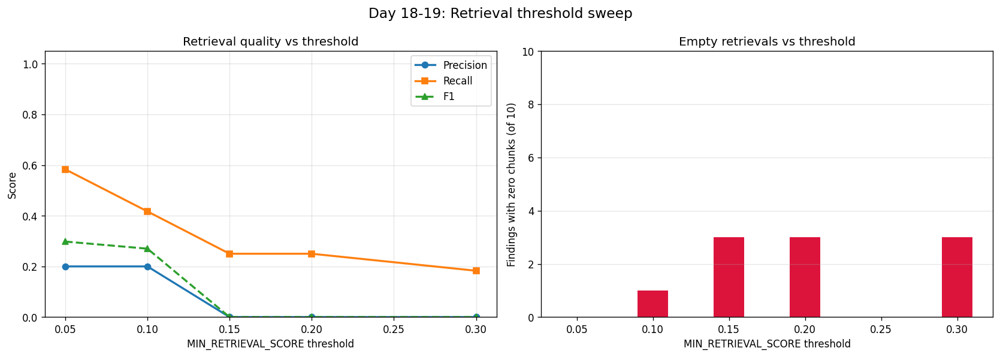

# infra-inspect-ai

> Production-grade agentic AI for building inspection and compliance automation.

[](YOUR_LOOM_URL_HERE)

## Overview

Six-agent LangGraph workflow that takes inspection photos and produces:

- Structured findings extracted by a vision LLM
- Compliance violations grounded in NBC / IS / NFPA building codes (hybrid RAG)
- Risk-scored issues with prioritization
- Work orders with SLAs, costs, and team routing
- Inspection reports (operational / executive / regulatory audiences)
- Follow-up notifications dispatched via MCP servers

## Architecture

```
START → memory_recall → inspection → compliance → risk → workorder
↓
memory_persist ← followup ← documentation ←┘
```

Each agent:
- Validated Pydantic input/output schemas
- Self-correcting retry loop on structured output failures
- Full Langfuse tracing (workflow → agent → LLM → RAG → MCP spans)

## Stack

| Layer | Choice |
|------|--------|
| Orchestration | LangGraph |
| Vision LLM | Google Gemini 2.5 Flash |
| Text LLM | IBM Watsonx (Llama 3.3 70b) with Gemini fallback |
| RAG | FAISS (dense) + BM25 (sparse) → cross-encoder rerank |
| Embedding | BGE-small-en-v1.5 |
| Reranker | BGE-reranker-base |
| Memory | SQLAlchemy + SQLite |
| External tools | Three MCP servers (filesystem, work orders, notifications) |
| Tracing | Langfuse |
| API | FastAPI with async job submission |
| UI | Streamlit |
| Evaluation | RAGAS-style + DeepEval |

## Highlights

**Multi-provider LLM routing.** Vision tasks route to Gemini (multimodal); text tasks route to Watsonx (much higher quota, faster). Provider swap is a `.env` change with zero code modification.

**Empirically-tuned RAG.** Built a labeled eval set, ran a threshold sweep, discovered the default `MIN_RETRIEVAL_SCORE=0.30` rejected 60% of findings. After tuning to 0.05, F1 improved 3.2x.

**Full-stack observability.** Every workflow run produces a Langfuse trace tree with per-agent spans, per-RAG-retrieval spans, per-MCP-call spans, and per-LLM-generation spans (with token counts).

**Production-shape API.** Async job submission with polling — long workflows don't block the HTTP request. Reusable from a Streamlit UI today, a Flutter app tomorrow.

## Quick Start

### Prerequisites

- Python 3.11 or 3.12
- Tesseract OCR (for ingesting scanned PDFs)
- Poppler (for PDF rendering)

### Setup

```bash
git clone https://github.com/<your-username>/infra-inspect-ai
cd infra-inspect-ai

python -m venv .venv
.venv\Scripts\activate            # Windows
# source .venv/bin/activate       # macOS/Linux

pip install -e ".[rag,mcp,api,observability,evals]"
cp .env.example .env              # then fill in API keys
```

### Build the RAG Index

Place your regulation PDFs in `data/building_codes/` (see [data/building_codes/README.md](data/building_codes/README.md)), then:

```bash
python -m scripts.ingest_codes
python -m scripts.build_bm25
```

### Run

Two terminals:

```bash
# Terminal 1 - FastAPI backend
python -m scripts.run_api

# Terminal 2 - Streamlit UI
streamlit run app.py
```

UI at http://localhost:8501. API docs at http://localhost:8000/docs.

## Evaluation Results

Built a labeled eval set of 10 inspection findings with expected regulation themes. Ran threshold sweep:

| Threshold | Precision | Recall | F1 | Zero-chunk failures |
|-----------|-----------|--------|-----|---------------------|
| 0.05 | 0.20 | 0.58 | **0.30** | 0 |
| 0.10 | 0.20 | 0.42 | 0.27 | 1 |
| 0.15 | 0.00 | 0.25 | 0.00 | 3 |
| 0.30 (original) | 0.00 | 0.18 | 0.00 | 3 |



Default threshold rejected 60% of findings outright. Tuning to 0.05 eliminated all zero-chunk failures and 3.2x'd recall.

## Project Status

21 of 25 days complete. Deployment + CI/CD + portfolio polish remaining.

This is a learning project — production deployment would require: real authentication, persistent multi-worker job queue, vector store on a managed service (Pinecone/Weaviate), Kubernetes orchestration of MCP servers, and proper secret management.

## License

TBD


### Failed Optimization: Parallel RAG Retrieval

Initial profiling via Langfuse showed compliance spent 60s on 5 sequential RAG retrievals
(75% of total workflow time). Naive intuition: parallelize via ThreadPoolExecutor with
max_workers=5. Result: per-batch latency grew from 5-10s to 47-51s. Total time only
dropped from 60s to 48s (1.2x).

Root cause: PyTorch CPU inference doesn't release the GIL as cleanly as numpy/FAISS.
Five concurrent reranker threads contend for the same cores, with Python overhead
multiplied while actual matmul stays constant.

Proper fix would be to batch all 5 queries into a single CrossEncoder.predict() call,
amortizing model invocation overhead. Deferred for a future iteration.

**Lesson:** Profile before parallelizing. GIL-free claims for PyTorch are environment-
dependent. CPU-bound parallelism needs multi-process or GPU, not threads.