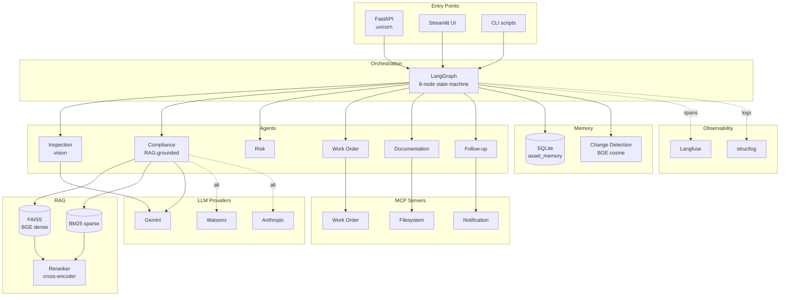

# Architecture

A high-altitude view of how infra-inspect-ai is structured, why the layers are separated, and how a single request flows through the system.

For per-agent details, see [`workflow.md`](workflow.md). For the retrieval pipeline, see [`rag-pipeline.md`](rag-pipeline.md). For observability and correlation, see [`observability.md`](observability.md).

---

## System overview

The system is a multi-agent inspection workflow with three entry points (FastAPI service, Streamlit UI, CLI script), a shared LangGraph orchestration core, a hybrid RAG layer over building codes, a memory layer over SQLite, three MCP servers for side effects, and end-to-end observability via Langfuse.



---

## Layer responsibilities

The system is organized in eight layers. Each layer has one responsibility; cross-layer concerns (logging, tracing, errors) are handled by horizontal services.

### Entry points

Three interchangeable surfaces, all calling the same workflow:

- **FastAPI** (`src/api/`) — async job submission, polling, health checks. Production-facing.
- **Streamlit UI** (`app.py`) — file upload, status polling, report download. Demo and manual-test facing.
- **CLI scripts** (`scripts/test_workflow.py`, etc.) — direct invocation for development, evaluation, and batch use.

All three construct an `AgentState`, hand it to `build_workflow().invoke(state)`, and process the resulting state. Adding a fourth entry point (e.g., a Slack command) is a localized change.

### Orchestration

`src/graph/workflow.py` defines the LangGraph state machine. Eight nodes, conditional edges between them. The state object (`src/schemas/state.py::AgentState`) is the contract between all nodes — every node reads what it needs from state, writes its outputs back, and returns the mutated state.

The workflow shape:
```
START → memory_recall → inspection
↓
(any findings?)
yes ↙       ↘ no
compliance      memory_persist → END
↓
(any findings?)
yes ↙       ↘ no
risk        memory_persist → END
↓
workorder → documentation → followup → memory_persist → END
```
Conditional edges are pure functions (`should_run_compliance`, `should_run_risk`) declared at graph-build time. They are individually unit-testable.

### Agents

Six agents, each a class inheriting from `BaseAgent` (`src/agents/base.py`):

| Agent | File | Role |
|-------|------|------|
| Inspection | `agents/inspection.py` | Vision model extracts findings from photos |
| Compliance | `agents/compliance.py` | Grounds findings against building codes via RAG |
| Risk | `agents/risk.py` | Dedupes, scores, and prioritizes issues |
| Work Order | `agents/workorder.py` | Creates work orders with team, SLA, cost |
| Documentation | `agents/documentation.py` | Composes Markdown audit report |
| Follow-up | `agents/followup.py` | Plans notifications and re-inspections |

Each agent has:
- A `run()` method taking domain inputs and returning a Pydantic output schema
- A prompt module in `src/prompts/` with system + user templates
- A schema module in `src/schemas/` defining its input/output models

Agents do not depend on each other directly. The workflow file is the only place that knows the order.

### RAG layer

The compliance agent retrieves grounded chunks from the building-codes corpus before producing violations.

- `src/rag/embeddings.py` — BGE-small-en-v1.5 wrapper, cached via `@lru_cache`
- `src/rag/reranker.py` — BGE-reranker-base wrapper, cached
- `src/rag/vectorstore.py` — FAISS index loader
- `src/rag/bm25.py` — BM25 sparse retriever
- `src/rag/hybrid.py` — RRF fusion (k=60)
- `src/rag/retriever.py` — Public `RetrievalResult` interface; orchestrates dense → sparse → fuse → rerank → threshold-filter
- `src/rag/ingest.py` — One-time corpus ingestion (PDF → OCR → chunk → embed → persist)

The hybrid retrieval architecture and the empirical threshold-tuning story are covered in [`rag-pipeline.md`](rag-pipeline.md) and [ADR-0003](adr/0003-hybrid-rag-with-rrf-and-reranker.md).

### Memory layer

Inspections accumulate. `src/memory/` records every run and makes prior runs queryable.

- `src/memory/store.py` — SQLAlchemy ORM models: `Asset`, `InspectionRun`, `FindingRecord`, `WorkOrderRecord`, `NotificationRecord`
- `src/memory/connection.py` — Module-level singleton session factory. One engine per process.
- `src/memory/repository.py` — `AssetRepository` class: the only place SQL is constructed. Agents do not import SQLAlchemy directly.
- `src/memory/change_detection.py` — Classifies new findings against history (BGE cosine, lexical fallback, category gate)

The change-detection logic is documented in [ADR-0006](adr/0006-bge-semantic-change-detection.md).

### MCP servers

Three sandboxed subprocesses handle side effects:

- `src/mcp_servers/filesystem_server.py` — bounded file reads/writes
- `src/mcp_servers/workorder_server.py` — work order CRUD
- `src/mcp_servers/notification_server.py` — notification dispatch

The connection manager (`src/mcp_clients/manager.py`) maintains a background asyncio event loop, opens connections at startup, runs a health-ping thread, and provides a synchronous `call_tool()` API for the agents.

Health monitoring is covered in [`observability.md`](observability.md). The MCP architecture choice is documented in [ADR-0007](adr/0007-mcp-for-side-effects.md).

### LLM router

`src/llm/router.py` provides a single `get_llm()` function returning a LangChain-compatible chat model for any of three providers (Gemini, Watsonx, Anthropic). Each agent's `BaseAgent.__init__` calls `get_llm()` with task-appropriate temperature.

The router caches Watsonx client construction via `@lru_cache(maxsize=8)` to avoid repeated 3-roundtrip handshakes (saves ~24s per workflow).

Configuration via `.env`:
- `DEFAULT_LLM_PROVIDER` — for text agents
- `VISION_LLM_PROVIDER` — for the inspection agent (can differ)

See [ADR-0002](adr/0002-multi-provider-llm-routing.md).

### Observability

Three components, deeply integrated:

- **Langfuse** (`src/tracing/setup.py`) — every workflow run produces a trace tree. Each agent's `run()` is a span. RAG retrievals, MCP calls, and LLM calls are child spans. Traces are tagged with `session_id = X-Request-ID` for cross-trace correlation.
- **structlog** (`src/utils/logging.py`) — JSON-structured logs with automatic `request_id` injection.
- **Correlation IDs** (`src/api/request_context.py`) — `X-Request-ID` header propagated through middleware, ContextVar, background threads, workflow state, Langfuse session, and DB row.

The full story is in [`observability.md`](observability.md) and [ADR-0008](adr/0008-correlation-ids-end-to-end.md).

---

## Cross-cutting concerns

### Configuration

`src/config/settings.py` provides Pydantic Settings. Loaded once from `.env`. Cached via `get_settings()`. Available to any module.

Settings categories:
- LLM provider credentials and defaults
- Tracing credentials (Langfuse)
- MCP server commands and enablement
- Retrieval thresholds
- Logging level

The `.env.example` is committed; `.env` is gitignored.

### Schemas

`src/schemas/` holds Pydantic models for every cross-layer contract:

- `enums.py` — controlled vocabularies (Severity, Priority, IssueCategory, ComplianceStatus)
- `inspection.py` — InspectionFinding, InspectionReport
- `compliance.py` — ComplianceViolation, ComplianceCitation
- `risk.py` — RiskedIssue, RiskAssessment
- `workorder.py` — WorkOrder, WorkOrderPackage
- `documentation.py` — InspectionDocument, ReportAudience
- `followup.py` — FollowUpPlan, Notification, ScheduledTask
- `memory.py` — AssetMemory, AssetSummary, HistoricalFinding, HistoricalWorkOrder
- `state.py` — AgentState (the workflow's shared state)

Every value crossing a layer boundary is a validated Pydantic model. This catches a class of bugs (typos in dict keys, type mismatches) at parse time rather than at use time.

### Structured output with retry

`src/utils/structured_output.py::invoke_with_retry` is the canonical pattern for asking an LLM to produce a Pydantic-validated output:

```python
result = invoke_with_retry(self.llm, RiskAssessment, messages)
```

On the first attempt, the LLM produces JSON. If parsing fails, the function reformats the error and retries up to 3 times. If all retries fail, raises. Every agent uses this pattern.

### Error handling philosophy

Agents catch their own exceptions and append to `state.errors`, rather than letting exceptions propagate up the workflow. This means a failure in one agent doesn't kill the whole run — downstream agents see the missing outputs and adapt (e.g., compliance produces no violations → risk runs on findings alone → workorder produces fewer WOs).

The trade-off: a partially-failed run still produces some output. This is appropriate for an inspection workflow where partial information is better than no information. Critical errors are still logged with ERROR level and visible in Langfuse with `level="ERROR"` span attribute.

---

## Process model

A single Python process hosts:

- The FastAPI app (uvicorn worker)
- The LangGraph workflow (synchronous, runs in BackgroundTasks thread)
- The MCP connection manager (asyncio event loop in a dedicated thread)
- Three MCP server subprocesses (separate Python processes, communicating via stdio JSON-RPC)
- The BGE embedding model (in-process, loaded once at boot)
- The BGE reranker model (in-process, loaded once at boot)
- The FAISS index (in-process, loaded once at boot)
- The BM25 index (in-process, loaded once at boot)
- The SQLite database file (on disk, accessed via a singleton SQLAlchemy engine)
- The Langfuse client (in-process, async batched flushing)

For a single-worker deployment this is sufficient. Scaling considerations:

- **Multi-worker uvicorn.** The MCP subprocesses, BGE models, and FAISS index are per-worker. Memory cost multiplies by worker count. For >2 workers, consider externalizing the vector store and embedding service.
- **Concurrent writes.** SQLite serializes writes. ~5 writes per inspection × N concurrent inspections. For >50 concurrent inspections, switch to Postgres.
- **Distributed deployment.** Each component (workflow, MCP, vector store) could become a separate service. The MCP protocol and the embedding service interface (`get_embeddings()`) abstract the network boundary.

See [`deployment.md`](deployment.md) for the practical deployment guide.

---

## What's not in this diagram

Deliberately excluded from the core architecture:

- **Authentication / multi-tenancy.** Out of scope for a portfolio system.
- **Real ticketing system integration.** The work-order MCP server writes to the same SQLite DB; production would integrate with Jira/ServiceNow.
- **Real notification channels.** The notification server currently logs only; production would dispatch to Slack/email/etc.
- **Distributed tracing across instances.** Single-process; Langfuse correlates within a process.
- **A managed vector DB.** FAISS is local; production would use Pinecone/Qdrant for >1M chunks.

See the README's "What's not in scope" section for full deferral rationale.