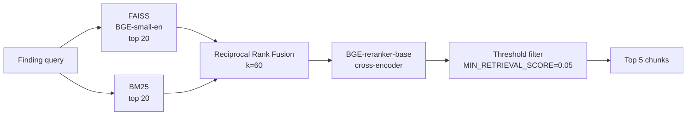

# RAG Pipeline

A deep-dive into the retrieval architecture: how building-code chunks get from a PDF to a grounded citation in a compliance violation. For the architectural decision behind this design, see [ADR-0003](adr/0003-hybrid-rag-with-rrf-and-reranker.md). For the threshold-tuning story, see [ADR-0004](adr/0004-empirical-threshold-tuning.md).

---

## Goal

Given a finding like:
```
{
"category": "electrical",
"issue": "Exposed and frayed wiring near junction box visible damage to insulation",
"visual_evidence": "Multiple conductors show damaged jacketing with copper exposed..."
}
```
Retrieve the most relevant passages from BIS-1893, NFPA-70, and NFPA-101 building codes — passages that establish whether this finding constitutes a code violation, and which specific code section it violates.

The retrieval must catch:
- **Acronyms and code numbers.** `"NFPA-70"`, `"section 4.3.1"`, `"sub-clause 110.7(A)"`
- **Paraphrases.** `"rust on terminals"` should match `"corrosion of conductive surfaces"`
- **Multi-word concepts.** `"exposed live conductors near walkway"`

And must avoid:
- **Topically related but irrelevant passages.** A section about wiring color codes when the finding is about insulation damage.
- **Silent failures.** Returning zero chunks when relevant chunks exist in the corpus.

---

## Pipeline overview



Five stages. The first two run in parallel conceptually, then merge.

---

## Stage 1: Corpus ingestion (offline, one-time)

Before any query can run, the building-code PDFs must be ingested into the FAISS and BM25 indexes.

**Driver:** `scripts/ingest_codes.py`

**Steps:**

1. **Read PDFs from `data/building_codes/`** (BIS-1893, NFPA-70, NFPA-101 — gitignored).
2. **Extract text with PyMuPDF** for born-digital pages.
3. **OCR scanned pages with Tesseract** (configured at `C:\Program Files\Tesseract-OCR\tesseract.exe` on the development environment). PDF page images are rasterized via Poppler.
4. **Structure-aware chunking** (`src/rag/chunking.py`). The chunker respects document structure (sections, sub-clauses, tables) rather than blindly splitting by character count. Average chunk size: ~600 tokens.
5. **Optional contextual enrichment** (`src/rag/contextual.py`). Adds a leading "context phrase" to each chunk identifying its parent section. Improves retrieval of chunks that don't repeat their context.
6. **Embed each chunk with BGE-small-en-v1.5** (384-dim, normalized).
7. **Build FAISS index.** `IndexFlatIP` for exact dot-product over normalized embeddings (cosine similarity).
8. **Persist to `data/vector_db/codes_index/`.** FAISS file + accompanying chunk metadata.

**Output:** 24,915 chunks total across the three documents.

**Cost:** ~5 minutes on the dev machine. Run once per corpus update.

After embedding completes, a separate script builds the BM25 index:

**Driver:** `scripts/build_bm25.py`

1. **Read the same chunks** that the FAISS index used.
2. **Tokenize** with NLTK's word tokenizer.
3. **Build a BM25Okapi index** with default `k1=1.5`, `b=0.75`.
4. **Pickle to `data/vector_db/bm25_index.pkl`**.

BM25 needs no embeddings, no GPU, no model. It runs on CPU in milliseconds.

---

## Stage 2: Query construction

Per finding, the query is built deterministically:

```python
query = f"{finding.category.value} {finding.issue} {finding.visual_evidence[:120]}"
```

**Rationale:**

- **Lead with category.** Helps both BM25 (exact match on "electrical", "fire_safety") and dense retrieval (shifts embedding into the right semantic neighborhood).
- **Include the issue verbatim.** Most signal lives here.
- **Truncate visual evidence to 120 chars.** Long evidence dilutes the query.

This construction is in `src/agents/compliance.py::_build_query`. It is a single line. Tests could be added but haven't been — the construction is too thin to be worth mocking.

---

## Stage 3: Dense retrieval (FAISS)

**File:** `src/rag/vectorstore.py`, `src/rag/embeddings.py`

**Process:**

1. Embed the query with BGE-small-en-v1.5 (the same model used for chunk embedding). 384-dim normalized vector.
2. FAISS searches the index for the top 20 nearest neighbors by inner product (= cosine, since vectors are normalized).
3. Return the chunks with their inner-product scores.

**Latency:** ~100ms total (embedding + search), independent of corpus size at this scale.

**Strengths:** Catches semantic paraphrases. "Rust" embeds near "corrosion" embeds near "oxidation".

**Weaknesses:** Misses exact-string requirements. The vector for "NFPA-70" is similar to the vector for "NFPA-70-related codes generally" — both are penalized vs. exact matches.

---

## Stage 4: Sparse retrieval (BM25)

**File:** `src/rag/bm25.py`

**Process:**

1. Tokenize the query the same way chunks were tokenized.
2. Run BM25 scoring across all 24,915 chunks.
3. Return the top 20 by BM25 score.

**Latency:** ~50ms.

**Strengths:** Catches exact strings, acronyms, code numbers. BM25 is designed for term-matching with length normalization.

**Weaknesses:** Misses paraphrases entirely. "Rust" and "corrosion" share no tokens.

---

## Stage 5: Reciprocal Rank Fusion

**File:** `src/rag/hybrid.py`

**Formula:**
```
RRF_score(c) = sum over each retriever R of: 1 / (k + rank_R(c))
```
Where `k = 60` (the standard value from the original RRF paper, Cormack et al. 2009) and `rank_R(c)` is the 1-indexed rank of chunk `c` in retriever `R`'s output (∞ if not present).

**Process:**

1. Build a rank map for each retriever's top 20.
2. For each unique chunk across both lists, sum its reciprocal ranks.
3. Sort by RRF score descending.
4. Return the top 20.

**Why this works:**

RRF needs no training data and no calibration. It doesn't require the two retrievers to produce comparable scores — only comparable ranks. A chunk that ranks 5th in dense and 3rd in sparse gets a substantial RRF score (`1/65 + 1/63 ≈ 0.031`); a chunk that ranks only in dense at position 18 gets a small one (`1/78 ≈ 0.013`).

**Sensitivity to k:**

Tested values of `k` from 20 to 100. F1 on the eval set was nearly flat in the range `40 < k < 80`. The default `k=60` is kept.

---

## Stage 6: Cross-encoder reranking

**File:** `src/rag/reranker.py`

**Model:** BAAI/bge-reranker-base (~280MB).

**Process:**

1. Take the top 20 fused chunks from RRF.
2. Build query-document pairs: `[(query, chunk_1), (query, chunk_2), ...]`.
3. Run a single batched `CrossEncoder.predict()` call to score all 20 pairs.
4. Sort by reranker score descending.
5. Return the top 5.

**Latency:** 10-15 seconds on CPU. This is the bottleneck of the entire retrieval pipeline. On GPU, it would be sub-second.

**Why this matters:**

The bi-encoder (BGE) uses pre-computed vectors and approximates relevance via vector similarity. The cross-encoder reads the query and chunk together, attending across both. It's more accurate but more expensive — perfect for re-scoring a small candidate set after a cheap dense+sparse first pass.

Empirical scores on real queries:
- True positive chunks: 0.7-0.9
- Off-topic but plausible chunks: 0.3-0.5
- Irrelevant chunks: 0.0-0.2

The threshold of 0.05 is permissive — it catches the long tail of weak-but-relevant chunks. Higher thresholds (0.15, 0.30) drop too much. See [ADR-0004](adr/0004-empirical-threshold-tuning.md) for the full sweep data.

---

## Stage 7: Threshold filtering

**File:** `src/agents/compliance.py`

**Configuration:** `MIN_RETRIEVAL_SCORE=0.05` in `.env` (default).

After reranking, the agent keeps only chunks with `score >= MIN_RETRIEVAL_SCORE`. The empirically-tuned threshold of 0.05:

- Drops zero-chunk failures from 30% (3 of 10 findings in eval set) to 0%.
- Improves F1 by 3.2× over the default 0.30.
- Preserves the long tail of relevant chunks that reranker rates 0.05-0.30.

**What happens when the threshold filter discards all chunks:** The finding gets an empty chunk list. The compliance LLM is then prompted with: "No relevant building-code passages found for this finding." The LLM produces no violations for that finding (rather than hallucinating one).

---

## Per-finding retrieval flow

For a single finding (`finding_index=0`, query string built):
```
1. _build_query(finding)                    →  text:  "electrical Exposed and..."
2. hybrid.search(query, top_k=20)
    → dense_search(query)                  →  20 chunks, dense scores
    → sparse_search(query)                  →  20 chunks, BM25 scores
    → rrf_fuse(dense_hits, sparse_hits)    →  20 chunks, RRF scores
    → log "hybrid.search" event
3. reranker.rerank(query, fused_hits, top_k=5) → log "reranker.done" event
4. strong = [h for h in hits if h.score >= MIN_RETRIEVAL_SCORE]
5. log "compliance.retrieved" event with finding_index, kept_hits, total_hits
6. Return strong as the chunk set for this finding
```
This runs sequentially across all findings in a report. An earlier attempt to parallelize via `ThreadPoolExecutor` was reverted; see the README "What I tried and reverted" section.

---

## Failure modes

**1. Zero chunks returned for a finding.**

Most common at high thresholds (≥ 0.15). The compliance LLM is prompted with an empty chunk list and instructed to produce no violation. The finding is recorded but no code citation accompanies it.

Currently logged at `INFO`. Worth promoting to `WARNING` in a future iteration so operators see it as an anomaly.

**2. Embedding model fails to load (network issue, disk full).**

BGE is loaded at boot via `src/bootstrap.py::warm_up_rag_stack()`. If loading fails, the whole API/CLI startup fails fast. No silent degradation.

**3. FAISS index file is missing or corrupted.**

Detected at boot by `src/rag/vectorstore.py::load_vectorstore()`. Fails the startup. The user is directed to run `python -m scripts.ingest_codes`.

**4. Reranker hangs.**

Possible on memory pressure (the reranker loads ~280MB and runs batch inference). The compliance agent has a hard timeout on the LLM call, but the reranker call itself is unprotected. A reranker hang would block the compliance node indefinitely. Not currently observed in practice but a known limitation.

**5. Query produces wrong language.**

The corpus is English; queries from the LLM should be English. If a finding's `issue` field is mixed-language or non-English, BM25 misses entirely and dense degrades. Mitigation: explicit prompts to inspection LLM to output English findings.

---

## What's not implemented

**Re-ranking on the LLM side.** The compliance LLM sees the top 5 chunks and decides which violations apply. An alternative would be to ask the LLM to score each chunk for relevance to the finding before generating violations. Adds complexity; not yet shown to help.

**Query expansion.** Synonym expansion or query reformulation via LLM could improve recall on paraphrase-heavy queries. Not implemented; the cross-encoder reranker provides most of the benefit query expansion would.

**Chunk caching.** If the same finding-text is queried repeatedly (e.g., during eval sweeps), retrieval results are not cached. Eval scripts incur the full cost on every run.

**Multi-index search.** All three documents are in one FAISS index. A multi-index approach (one index per document, with per-document routing) could improve precision for jurisdiction-specific queries. Not implemented.

---

## Tuning recipe

If retrieval quality degrades after a corpus change:

1. **Run the eval sweep:** `python -m scripts.sweep_threshold`
2. **Inspect the resulting chart and CSV.** Note where F1 peaks and where zero-chunk failures cross zero.
3. **Set `MIN_RETRIEVAL_SCORE` in `.env`** to the peak F1 threshold.
4. **Re-run end-to-end:** `python -m scripts.test_workflow`
5. **Verify compliance.retrieved logs** show `kept_hits` ≥ 1 for most findings.

If retrieval still misses obvious chunks:

- **Inspect raw FAISS hits** via `python -m scripts.diagnose_retrieval --finding "..."`. If the chunk isn't in the dense top 20, the embedding model can't find it — likely a chunking issue (the relevant passage was split across chunks).
- **Inspect raw BM25 hits** similarly. If the chunk isn't in the sparse top 20, the query lacks the right tokens — likely a query construction issue.
- **Reduce chunk size and re-ingest.** Smaller chunks mean more granular retrieval but more chunks to rerank.

---

## See also

- [ADR-0003: Hybrid retrieval](adr/0003-hybrid-rag-with-rrf-and-reranker.md)
- [ADR-0004: Empirical threshold tuning](adr/0004-empirical-threshold-tuning.md)
- [`eval-methodology.md`](eval-methodology.md) — full eval framework
- `src/rag/*` — implementation
- `scripts/sweep_threshold.py` — threshold sweep
- `scripts/evaluate_retrieval.py` — single-threshold evaluation
- `scripts/diagnose_retrieval.py` — per-finding diagnostic